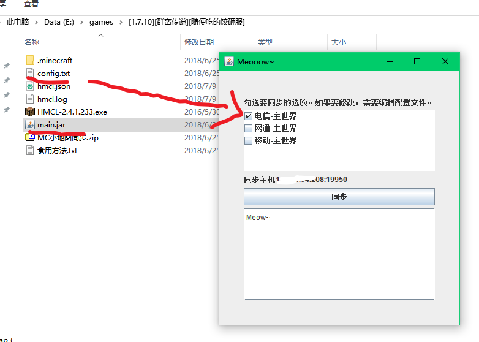

# VoxelSync
A tool synchronizes voxelmap files among Minecraft players.
VoxelMap is a minecraft mod that shows (and records) 2d map. It records areas that local player once reached and the outsides remains black.  
This program was created to synchronize these map files among all players so that everyone can see areas that was reached by anyone.

## Atention 注意
This program was only designed to be used among several friends that play Minecraft together.  
The programs have a basic user interface which enables one-click synchronizaion, and relies on **pre-written** config file to work, 
Which means **you won't be able to use it**, generally speaking. 
这个东西只是跟几个一起van Minecraft的姬友用来同步VoxelMap小地图的，依赖于预先编写的配置文件来工作，也就是说通常来讲你下载了是用不了的。 



## Example for Client side config.txt
```json
{
"maps":[
{
"name":"电信-主世界",
"folder":"dx.k.mcmiao.com~colon~11475",
"subdir":"DEFAULT (dimension 0)",
"remoteid":0,
"checked":true
},{
"name":"网通-主世界",
"folder":"wt.k.mcmiao.com~colon~11475",
"subdir":"DEFAULT (dimension 0)",
"remoteid":0,
"checked":false
},{
"name":"移动-主世界",
"folder":"yd.k.mcmiao.com~colon~11475",
"subdir":"DEFAULT (dimension 0)",
"remoteid":0
}],
"server":"1.2.3.4",
//IP or domain the service is on
"port":2333,
//port for THIS service NOT minecraft itself!
"你是猫吗":"喵"
}
```

### Explains 
* `folder`: VoxelMap's cache folder under <Your game directory>\.minecraft\mods\VoxelMods\voxelMap\cache. VoxelMap will create one when you first join a server. The server shall be saved on your Minecraft's server list and not edited since created. If you have multiple items on server list that are different route of a same server you may want to symlink them together. 
* `subfolder`: A certain subfolder of the previous `folder` representing a dimension of the server's gamemap.  
* `remoteid`: Remote repository id. Different route of same server shall share a same id, different dimensions (subfolder) shall use different ids, different servers shall use different ids.  
* server and port: You're supposed to having build the project and run the jar file on a server. Fill in its domain/ip and port.
  
### Example for Server side config.txt
```json
{
  "port":2333,
  "repo":"./voxelsync/"
}
```

### How to run:
1. Clone & open in IDEA;  
2. Build client side AND server side jar;  
3. Edit client side AND server side config.txt using Notepad++ with encoding UTF-8 No BOM header;
4. Distribute client side jar AND config to your friends that plays with you. The files shall be placed along with Minecraft launcher and `.minecraft` folder in the root directory of your Minecraft;  
5. Upload server side jar AND config to your server, if you plays over LAN then use your PC or router, otherwise you need a public IP address, maybe you want a VPS;  
6. Create the directory of `repo`. `Repo` is defined in server side config.txt. Make sure the program have write access to it (on Linux);  
7. Run server side jar in a `screen` via SSH (Linux server incl. router) or `Powershell` (pc or laptop) or `terminal` (Linux desktop);  
8. Quit server from Minecraft before synchronization.

test
